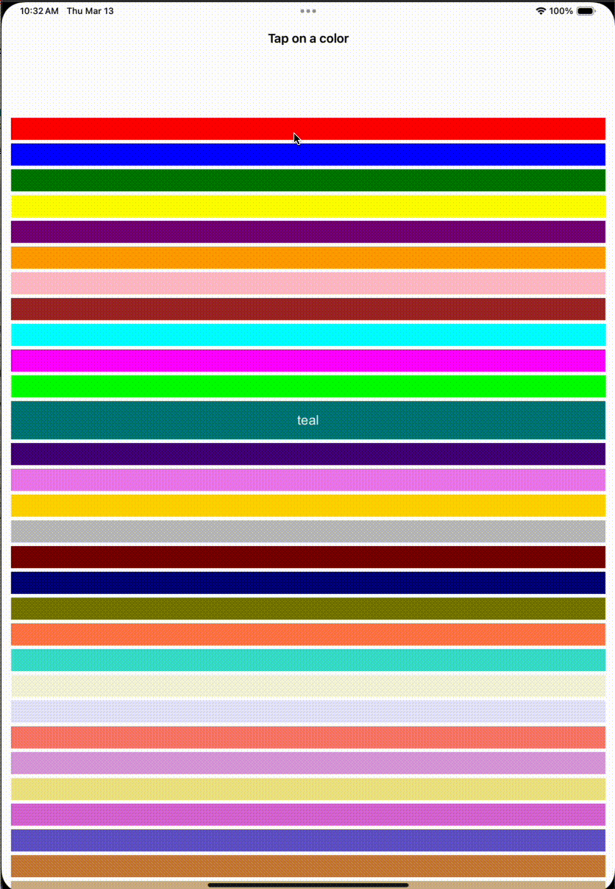

Sample project demonstrating an issue with touch events in a web view on iOS 18.4 Beta 2.

# Requirements
* Xcode 16.3 beta 2 (16E5121h)

# Explanation
If a webview has a modified `contentInset` top value, the `touchend` event sent to the webview is incorrectly offset. 
Tapping a row triggers a `touchend` event on the wrong row.
A workaround is to scroll a few rows down before tapping.

